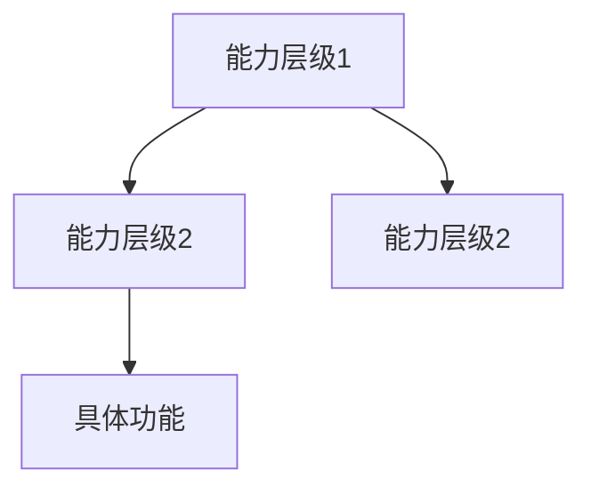

# 产品调研文档模板

> 使用说明：复制此模板，根据实际调研内容填充

---

# [产品名称] 产品与 AI 能力研究

> 研究对象：[产品名称及版本]  
> 研究目的：[为什么研究这个产品，期望获得什么启发]  
> 研究日期：YYYY-MM-DD  
> 证据原则：以官方资料为主，第三方为辅

---

## 1. 一句话结论

**[用一句话概括核心发现，让读者30秒内知道这篇文档的价值]**

---

## 2. 解决什么问题

### 2.1 目标用户痛点
- [痛点1]
- [痛点2]
- [痛点3]

### 2.2 传统方案的不足
| 问题 | 描述 |
|------|------|
| [问题1] | [具体表现] |
| [问题2] | [具体表现] |

### 2.3 该产品的解决思路
[一句话概括产品的核心思路]

---

## 3. 核心能力拆解

### 3.1 能力全景图

### 3.2 各模块详解
| 模块 | 核心能力 | AI 参与方式 |
|------|---------|------------|
| [模块名] | [能力描述] | [AI如何参与] |

---

## 4. AI 能力详解

### 4.1 AI 在各环节的作用
| 环节 | AI 做什么 | AI 不做什么 | 为什么这样分工 |
|------|----------|------------|---------------|
| [环节1] | [AI职责] | [边界] | [原因] |

### 4.2 AI 技术实现要点
- [技术点1]
- [技术点2]

### 4.3 AI 效果保障机制
- [如何保证AI输出质量]
- [如何验证AI结果]

---

## 5. 对 Performance Center 的借鉴

### 5.1 最值得借鉴的 3 点
1. **[借鉴点1]**：[具体说明]
2. **[借鉴点2]**：[具体说明]
3. **[借鉴点3]**：[具体说明]

### 5.2 不适合直接复用的部分
| 内容 | 原因 | PC 应该如何调整 |
|------|------|----------------|
| [内容] | [原因] | [调整建议] |

### 5.3 建议的落地方案
| Pulse能力 | PC可借鉴形态 | 建议优先级 | 原因 |
|----------|-------------|:----------:|------|
| [能力] | [形态] | P0/P1/P2 | [理由] |

---

## 6. 产品优势与限制

### 6.1 核心优势
- [优势1]
- [优势2]

### 6.2 已知限制
| 限制 | 影响 | 应对策略 |
|------|------|----------|
| [限制1] | [影响] | [策略] |

---

## 7. 最终判断

**[一段话总结：这个产品最核心的创新是什么，PC应该学什么、不学什么]**

---

## 8. 官方资料链接

1. [产品官网](URL)
2. [帮助文档](URL)
3. [发布说明](URL)
4. [其他资料](URL)

---

*文档版本：v1.0 | 最后更新：YYYY-MM-DD*
