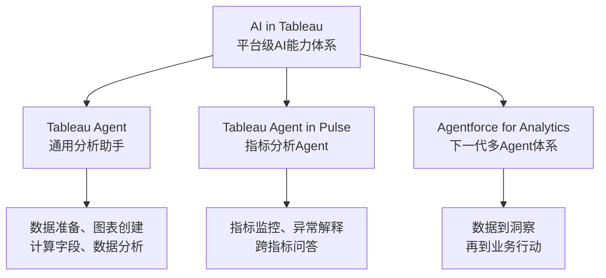
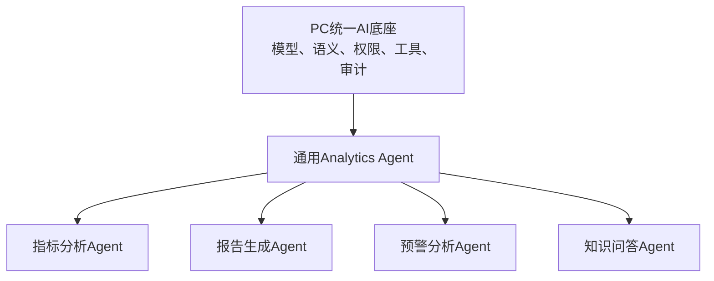
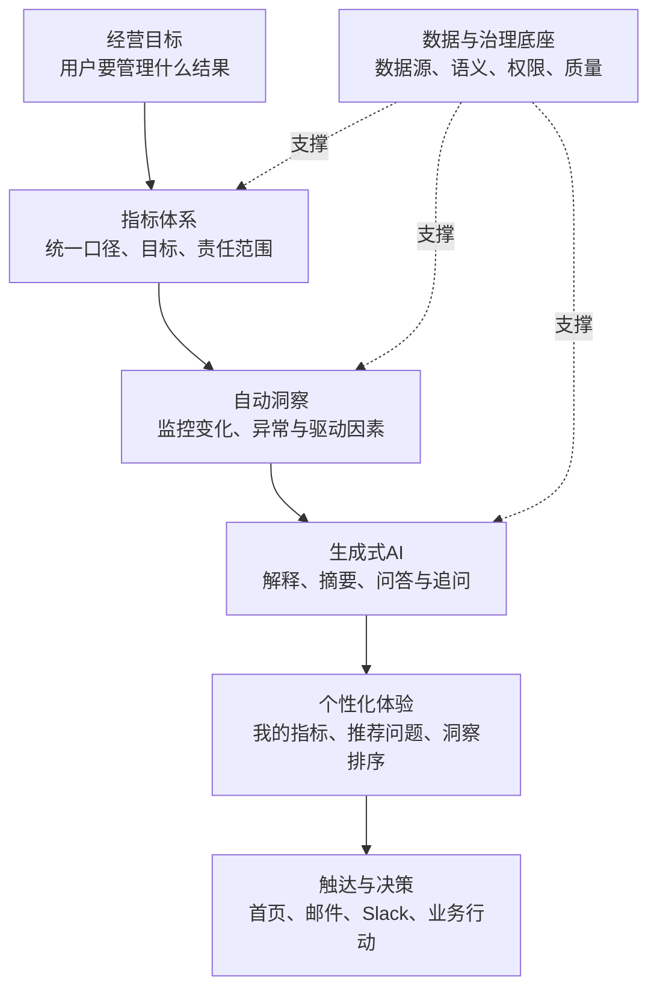

# Tableau Pulse 产品与 AI 能力研究

> 研究对象：Tableau Pulse  
> 研究目的：理解全球成熟产品如何利用 AI 改造经营绩效管理，并为 Performance Center 产品规划提供参考  
> 研究日期：2026-07-30  
> 证据原则：以 Tableau / Salesforce 官方产品页面、帮助文档和发布说明为主

---

## 1. 一句话结论

**Tableau Pulse 是一个以“经过治理的业务指标”为核心，主动向每个用户提供个性化绩效变化、原因解释和连续追问的 AI 指标洞察产品。**

它不是传统 Dashboard 的简单升级，也不是一个可以任意分析全部企业数据的通用 ChatBI。它改变的是用户获取绩效信息的方式：

> 传统 BI：用户打开报表，自己寻找问题。  
> Tableau Pulse：系统持续关注指标，主动告诉用户发生了什么，并帮助用户追问原因。

---

## 2. Tableau Pulse 解决什么问题

传统 BI 通常存在三个问题：

1. 用户需要主动进入报表，并且知道应该看哪张报表。
2. Dashboard 展示了大量数据，但普通业务用户不一定知道哪里最重要。
3. 看见指标变化后，用户还需要自己筛选、下钻或找分析师解释原因。

Tableau Pulse 将产品入口从“报表”改成了“指标”：

- 用户关注与自己有关的指标；
- 系统自动检测变化、趋势、贡献因素和异常；
- 通过自然语言与图表解释最重要的变化；
- 通过邮件、Slack 和 Tableau Cloud 主动触达用户；
- 用户可以继续点击推荐问题或用自然语言追问。

因此，Pulse 的核心价值不是生成更多图表，而是**降低业务用户持续理解绩效的成本**。

---

## 3. Tableau整体的专属AI体系

Tableau并不是只在Pulse中使用AI。它已经形成一套平台级专属AI能力，官方统称为 **AI in Tableau**，核心交互助手叫 **Tableau Agent**。

### 3.1 AI in Tableau、Tableau Agent与Pulse的关系

| 层级 | 产品或能力 | 定位 |
|---|---|---|
| 平台级AI体系 | AI in Tableau | 覆盖数据准备、建模、可视化、分析、指标洞察和治理 |
| 通用分析助手 | Tableau Agent | 嵌入Tableau不同模块，通过自然语言辅助完成分析任务 |
| 指标场景Agent | Tableau Agent in Pulse | 专门分析Pulse中已治理的指标、异常和跨指标关系 |
| 下一代Agent体系 | Agentforce for Analytics / Tableau Next | 使用多个专业Analytics Skill连接数据、洞察与业务行动 |

因此，Tableau Agent in Pulse不是一套孤立AI，而是Tableau统一AI体系在“指标绩效管理”场景中的专用实现。

### 3.2 AI分别进入哪些Tableau模块

| Tableau模块 | 专属AI能力 | AI主要作用 |
|---|---|---|
| Tableau Prep | Tableau Agent | 用自然语言清洗、转换数据，创建计算字段和数据处理流程 |
| Tableau Desktop / Web Authoring | Tableau Agent | 探索数据、创建可视化、生成或解释计算字段 |
| Dashboard | Tableau Agent | 围绕已发布报表进行问答、分析和洞察生成 |
| Tableau Pulse | Tableau Agent in Pulse | 分析指标变化、解释异常、跨指标问答和推荐追问 |
| Tableau Catalog | Tableau Agent | 辅助理解数据资产、字段描述和业务语义 |
| Tableau Next | Agentforce for Analytics | 通过多个专业Agent和Skills覆盖数据到行动的完整流程 |

### 3.3 Tableau Next的进一步演进

Tableau Next将“一个通用助手”进一步发展为多个专业Analytics Skill，主要包括：

- **Data Pro**：辅助准备、整理和建模数据；
- **Concierge**：通过自然语言回答业务问题、分析原因并生成相关可视化；
- **Inspector**：持续关注指标表现和重要变化。

这体现了Tableau AI产品规划的两个阶段：

1. 在既有Tableau模块中嵌入统一的Tableau Agent；
2. 在Tableau Next中将复杂分析过程拆分为多个专业Agent能力。

### 3.4 对Performance Center AI架构的启发

PC不需要为智能报告、指标分析、预警和问答分别建设完全独立的AI底座。更合理的结构是：

其中：

- 底层统一管理模型、业务语义、数据权限、工具调用和结果审计；
- 中层提供通用的数据分析与任务编排能力；
- 上层根据具体业务场景封装不同Agent；
- 不同Agent复用同一指标口径和权限体系。

这种方式既能避免重复建设，也能确保不同AI入口得到一致、可治理的业务答案。

官方资料：

- [AI in Tableau](https://www.tableau.com/products/artificial-intelligence)
- [AI in Tableau Features](https://help.tableau.com/current/tableau/en-us/tableau_gai_solutions.htm)
- [Tableau Agent](https://help.tableau.com/current/online/en-us/web_author_einstein.htm)
- [Tableau Next](https://www.salesforce.com/analytics/tableau-next/)

---

## 4. 产品规划视角：为什么 Pulse 的 AI 能力值得参考

### 4.1 它瞄准的是绩效管理中的真实断点

企业通常已经拥有大量报表，真正的问题却没有完全解决：

- 管理者不知道今天最应该关注什么；
- 指标发生变化后，业务人员不知道变化是否重要；
- 发现异常后，还需要等待分析师解释；
- 不同用户面对同一套报表，却承担不同的指标责任；
- 洞察通常停留在报表中，没有及时进入用户的日常工作。

Pulse没有把AI定位成一个孤立功能，而是让AI进入“监控—判断—解释—触达—追问”的完整链路。因此，它值得参考的不是聊天界面，而是**围绕用户决策过程重新组织产品**。

### 4.2 它给AI划定了合适的职责边界

Pulse没有让大模型直接承担所有分析，而是进行了职责拆分：

| 工作 | 主要承担者 | 原因 |
|---|---|---|
| 指标口径、权限和可分析维度 | 人工治理与语义模型 | 这些内容需要业务共识，不能由AI随意决定 |
| 趋势、异常、贡献度等计算 | 统计分析引擎 | 需要稳定、可重复和可验证 |
| 洞察筛选与排序 | 规则、影响评分和用户反馈 | 需要控制噪声并体现个性化 |
| 自然语言解释与连续交互 | 生成式AI | 适合处理表达、理解意图和多轮探索 |
| 最终业务判断与行动 | 用户 | 需要结合现实背景并承担决策责任 |

这种分工使AI既有价值又不过界。对企业产品而言，这比“把数据交给大模型，让它自由分析”更可靠。

### 4.3 它把AI从工具升级为产品运行机制

传统的AI规划经常是在现有页面上增加一个AI按钮。Pulse不同：

- 没有指标定义，AI就没有可信分析对象；
- 没有自动洞察，用户就不知道应该问什么；
- 没有个性化关注，推送就会变成信息噪声；
- 没有来源引用，AI解释就难以用于经营决策；
- 没有邮件、Slack等触达，洞察仍然只能等待用户主动查看。

所以，Pulse中的AI不是外挂能力，而是连接指标治理、分析引擎、用户体验和触达渠道的产品机制。

### 4.4 它代表了Performance Center的合理演进方向

一个传统PC通常解决“集中查看绩效”；Pulse进一步解决：

1. 哪些变化最值得关注；
2. 为什么发生变化；
3. 哪些变化与当前用户最相关；
4. 用户下一步应该继续分析什么；
5. 如何让洞察及时到达用户。

这使产品从 **Performance Reporting** 向 **Performance Intelligence** 演进：

> 展示绩效 → 理解绩效 → 主动管理绩效

---

## 5. Tableau Pulse 如何自上而下规划和使用 AI

这张图体现了Pulse的核心规划逻辑：

### 第一层：先确定经营目标，而不是先选AI功能

产品首先明确用户需要持续管理的业务结果，例如销售额、利润率或目标完成率。AI是否有价值，要看它能否帮助用户更快理解和改善这些结果。

### 第二层：将目标转化为受治理的指标

AI不能直接面对含义不清的数据。Pulse通过指标定义明确：

- 算什么；
- 如何聚合；
- 按什么时间观察；
- 可以从哪些维度分析；
- 谁可以看到；
- 目标值是什么。

这是AI可信工作的边界。

### 第三层：先由分析引擎产生事实

系统持续检测环比、同比、趋势、异常、贡献者和目标进度。这里使用统计分析，是因为这些任务需要结果稳定、可重复和可验证。

### 第四层：使用生成式AI降低理解成本

生成式AI将统计事实转化为业务用户容易理解的语言，并支持自然语言提问、连续追问及跨指标总结。它解决的是“如何理解和探索”，而不是代替底层计算。

### 第五层：根据角色和反馈做个性化

不同管理者负责不同区域、产品和指标。AI结合用户关注范围和反馈，对洞察进行筛选、排序和推荐，避免所有人看到同一份“大而全”报告。

### 第六层：把洞察送入用户工作流

通过首页、邮件和Slack等渠道主动触达，AI才真正改变用户行为。否则，即使生成了洞察，也只是把内容放在另一个等待访问的页面里。

### 自上而下与自下而上的区别

| 规划方式 | 出发点 | 常见结果 |
|---|---|---|
| 自下而上堆AI | 我们有大模型，可以做问答和摘要 | 功能很多，但用户不知道什么时候使用 |
| 自上而下规划AI | 用户需要持续管理什么结果 | 每项AI能力对应明确的决策环节 |

---

## 6. 为什么要在这些产品板块使用 AI

| 产品板块 | 不使用AI时的问题 | 为什么适合使用AI | AI应承担的工作 | AI不应承担的工作 |
|---|---|---|---|---|
| 指标首页 | 用户面对大量KPI，不知道优先看什么 | 指标多、变化快，适合自动筛选重点 | 排序重要变化、生成摘要、个性化推荐 | 自行修改指标口径 |
| 异常与预警 | 固定阈值容易产生过多提醒或遗漏变化 | AI和统计方法可以结合历史水平识别非预期变化 | 异常识别、影响评分、减少噪声 | 未经规则直接判断业务责任 |
| 原因分析 | 用户需要多次筛选和下钻 | 维度组合多，适合自动比较贡献度 | 识别主要驱动、拖累和异常记录 | 将相关性直接解释为因果关系 |
| 指标问答 | 普通用户不知道筛选器和图表怎么用 | 自然语言能够降低分析操作门槛 | 理解问题、调用可信指标、组织回答 | 脱离指标体系自由回答 |
| 智能报告 | 人工反复编写相似的绩效说明 | 事实稳定但表达重复，适合自动生成 | 汇总事实、生成叙述、适配角色 | 编造没有数据支持的结论 |
| 个性化推荐 | 同一首页无法满足不同角色 | 用户职责、关注指标和使用反馈存在差异 | 推荐相关指标、问题和洞察 | 形成无法解释的信息茧房 |
| 订阅与触达 | 用户必须主动进入系统查看 | AI可以判断“什么值得现在通知” | 选择内容、生成简报、控制频率 | 高频推送所有变化 |
| 行动建议 | 洞察与执行之间存在断点 | AI适合结合规则和知识提供候选方案 | 生成建议、关联Playbook、形成待办草案 | 未经授权自动执行高风险动作 |

### 提炼：哪些地方真正需要AI

不是所有PC模块都需要AI。适合使用AI的任务通常同时具有以下特征：

1. 信息数量大，人工无法持续逐项检查；
2. 数据持续变化，需要及时判断重要性；
3. 用户需要解释，而不仅是看到数字；
4. 不同角色需要不同内容；
5. 用户表达方式不统一，适合自然语言交互；
6. 结果能够通过指标、计算过程或来源进行验证。

反过来，指标口径审批、权限授权、最终业务决策等需要明确责任的任务，不应该完全交给AI。

---

## 7. Pulse 与传统 Tableau Dashboard 的区别

| 对比维度 | 传统 Dashboard | Tableau Pulse |
|---|---|---|
| 核心对象 | 报表和可视化页面 | 业务指标 |
| 使用方式 | 用户主动打开报表 | 系统主动推送指标洞察 |
| 信息组织 | 一张页面容纳多个图表 | 围绕单个或一组指标组织信息 |
| 分析方式 | 用户自己筛选、下钻 | 系统自动发现变化并推荐问题 |
| AI输出 | 报表创建或分析辅助 | 自然语言摘要、异常解释、指标问答 |
| 个性化 | 主要依靠权限和报表配置 | 根据用户关注的指标、筛选条件和反馈进行个性化 |
| 适合用户 | 分析师和熟悉报表的业务用户 | 管理者及普通业务用户 |
| 分析自由度 | 高，可进行自由探索 | 较低，限定在已定义的指标和维度中 |

**产品判断：**Pulse 没有替代传统 Dashboard。它承担的是“持续监控、主动发现和快速解释”，复杂的自由分析仍然需要传统 Tableau 分析能力。

---

## 8. 产品核心模型：Metric Definition → Metric → Follower

Pulse 的产品基础不是大模型，而是经过治理的指标结构。

### 8.1 Metric Definition（指标定义）

指标定义是统一的指标母版，也是同一组指标的单一事实来源，主要规定：

- 核心度量，例如销售额、订单量、利润率；
- 聚合方式，例如求和、平均值、去重计数；
- 时间字段和时间粒度；
- 允许用户使用的分析维度；
- 数字格式；
- 展示哪些洞察类型；
- 指标的业务描述、目标和业务语义。

一个指标定义可以产生多个具体指标。例如，“销售额”是指标定义，用户可以基于地区、车型或时间范围生成：

- 华东区月度销售额；
- 经销商 A 的季度销售额；
- SUV 车型年度销售额。

### 8.2 Metric（具体指标）

具体指标是用户实际关注和使用的对象。它是在指标定义之上应用了特定筛选条件、时间范围和目标值的结果。

### 8.3 Follower（指标关注者）

用户关注的是具体指标，而不是抽象的指标定义。关注后，用户会收到与自身职责相关的定期摘要和变化提醒。

这套结构使 Pulse 同时获得：

- **统一口径**：所有具体指标继承同一指标定义；
- **个性化**：不同用户关注不同区域、产品和时间范围；
- **可治理性**：数据源或业务定义发生变化时，可以集中修改指标定义；
- **可解释性**：AI只在已经定义好的指标、维度和时间范围内分析。

官方说明：[Create Metrics with Tableau Pulse](https://help.tableau.com/current/online/en-us/pulse_create_metrics.htm)

---

## 9. 用户完整使用流程

### 阶段一：分析人员准备指标

1. 选择一个已经发布的数据源；
2. 定义核心度量、聚合方式和时间字段；
3. 选择用户可以分析和筛选的维度；
4. 补充指标名称、业务描述、目标和展示格式；
5. 配置允许出现的洞察类型；
6. 发布指标定义。

### 阶段二：业务用户关注指标

1. 在 Pulse 中浏览已有指标；
2. 选择与自己有关的地区、产品或组织范围；
3. 设置时间范围和目标；
4. 关注该具体指标；
5. 也可以由管理员或指标创建者为用户或用户组添加关注。

### 阶段三：系统主动提供洞察

Pulse 持续计算指标并识别：

- 环比或同比变化；
- 当前趋势；
- 高于或低于正常范围；
- 最大贡献者和最大拖累者；
- 贡献是否过度集中；
- 记录级异常值；
- 趋势拐点；
- 距离目标的进度。

系统选择影响最大、相关性最高的洞察，通过自然语言和图表呈现，并可通过邮件或 Slack 摘要触达用户。

### 阶段四：用户继续追问

用户可以：

- 点击系统推荐的问题；
- 查看不同维度对指标变化的影响；
- 比较不同时间范围；
- 查看指标的主要贡献者和拖累者；
- 使用 Tableau Agent in Pulse 输入自然语言问题；
- 查看回答所引用的指标来源和支撑图表；
- 继续提出后续问题。

---

## 10. AI 能力拆解

| 用户场景 | Pulse能力 | AI具体做了什么 | 主要前置条件 | 用户价值 |
|---|---|---|---|---|
| 每天了解重要KPI | 个性化洞察摘要 | 将统计事实组织成自然语言摘要 | 已定义并关注指标 | 不必逐张打开报表 |
| 发现绩效变化 | 趋势与异常识别 | 识别异常值、趋势变化和非预期表现 | 连续的时间序列数据 | 更早发现问题 |
| 了解变化原因 | Driver / Contributor分析 | 对允许使用的维度进行贡献分析和排序 | 指标定义中配置分析维度 | 快速定位主要影响因素 |
| 不知道如何分析 | 推荐问题 | 根据当前指标和已检测洞察生成后续问题 | 已产生统计洞察 | 降低分析门槛 |
| 主动提出业务问题 | Tableau Agent in Pulse | 理解自然语言，组合相关指标和统计事实生成回答 | Tableau+、AI配置、指标组 | 支持连续探索 |
| 分析多个相关KPI | 跨指标分析 | 发现共同贡献者、同向/反向趋势、共同异常及指标相关性 | 指标具有兼容的时间粒度和维度 | 从单指标扩展到经营关系 |
| 判断回答是否可信 | 来源引用与支撑图表 | 将回答关联到具体指标来源和图表 | 指标与数据权限可访问 | 用户可以复核AI结论 |
| 提升个性化程度 | 洞察反馈排序 | 根据点赞或点踩调整洞察类型排序 | 开启个性化洞察排序 | 减少无关信息 |

### 10.1 AI不是直接“猜”结论

Pulse 的核心分析流程可以概括为：

1. 统计分析模块先检测变化、趋势、贡献者和异常；
2. 每个事实按照对指标的影响程度进行评分；
3. 系统筛选最相关的事实；
4. 生成式 AI 将这些统计事实组织成自然语言摘要；
5. 用户可以通过指标引用和图表复核回答。

官方将其描述为：自然语言摘要以统计事实作为 ground truth，再由 AI 进行语境化表达。

这意味着 Pulse 采用的是：

> **确定性指标与统计计算负责“事实”，生成式 AI 负责“解释、组织和交互”。**

这种设计比让大模型直接读取原始数据后自由回答更可控，也更适合企业绩效场景。

官方说明：[The Insights Platform and Insight Types in Tableau Pulse](https://help.tableau.com/current/online/en-us/pulse_insights_platform_insight_types.htm)

### 10.2 Tableau Agent in Pulse

Tableau Agent in Pulse 是原 Enhanced Q&A / Discover 能力的新名称，主要特点包括：

- 支持自然语言问题和连续追问；
- 支持一组指标的联合分析，而不仅是单个指标；
- 可以识别共同贡献者、跨指标异常和趋势关系；
- 支持指标相关性分析；
- 提供推荐问题和后续问题；
- 回答包含指标来源引用和支撑图表；
- 支持多语言提问和回答；
- 2026年7月官方已宣布其模型升级至 GPT‑5.2。

它是一个**受限领域分析 Agent**：只能分析 Pulse 指标体系中的信息，并不是企业通用问答助手。

官方说明：

- [Ask Questions and Discover Insights in Tableau Pulse](https://help.tableau.com/current/online/en-us/pulse_ask_discover_qa.htm)
- [Tableau July 2026 New Features](https://www.tableau.com/products/new-features)

---

## 11. Pulse 能发现哪些洞察

Pulse 当前重点覆盖的是描述性和基础诊断性分析，包括：

- 本期与上期相比发生了什么；
- 本期与去年同期相比发生了什么；
- 当前趋势是上升、下降还是出现拐点；
- 指标是否高于或低于正常范围；
- 哪些地区、产品、人员或其他维度贡献最大；
- 哪些维度造成指标下降；
- 指标是否过度集中在少数对象上；
- 是否存在影响结果的异常记录；
- 当前进度是否能够达到目标；
- 多个相关指标是否同向或反向变化。

官方同时把问题分成四级：

1. 描述性：发生了什么？
2. 诊断性：为什么发生？
3. 预测性：接下来可能发生什么？
4. 处方性：应该采取什么行动？

但官方帮助文档明确说明，Pulse 的 Insights Platform 目前主要聚焦**基础描述性分析**，并辅助用户进行部分诊断。它还不是一个成熟的自动预测和自动决策系统。

---

## 12. 数据、权限和技术前置条件

### 12.1 数据要求

创建 Pulse 指标需要：

- 使用单个已发布数据源；
- 数据包含可聚合的度量；
- 数据包含时间字段；
- 支持日、周、月、季度和年度粒度；
- 不适合依赖小时或分钟级变化的场景；
- 多数据源需要在发布前完成整合，不能在 Pulse 中直接进行数据混合；
- 字段名称和维度值需要使用业务人员能够理解的语言。

### 12.2 数据质量要求

Tableau 官方建议使用干净、结构化、经过验证的时间序列数据。数据格式不一致、字段语义模糊或高基数维度都会影响问答和洞察质量。

### 12.3 权限与治理

- 用户必须具备相应数据源和内容的访问权限；
- Tableau 权限体系和行级安全可控制用户能看到的数据；
- AI分析基于用户能够访问和关注的指标；
- 指标定义由具备相应角色的用户创建和维护；
- 2026年7月新增指标定义“最后修改者”展示，增强指标治理与责任追踪；
- Tableau Agent 可以按用户组进行灰度开放。

### 12.4 AI启用条件

Tableau Agent in Pulse：

- 适用于 Tableau Cloud；
- 属于 Tableau+ / Cloud+ 相关高级能力；
- 默认关闭，需要管理员启用；
- 正式启用通常需要连接 Salesforce org，并配置 Einstein Generative AI；
- Standard 和 Enterprise 客户可以使用限时试用。

---

## 13. 产品优势

### 13.1 从“报表中心”转向“指标中心”

用户不需要理解完整的报表目录，只需要关注与岗位相关的绩效指标。

### 13.2 从“被动查看”转向“主动触达”

洞察通过邮件、Slack 和产品首页进入用户日常工作流，减少用户忘记查看报表的问题。

### 13.3 AI建立在治理后的指标上

AI不是面对整个数据库自由发挥，而是在指标定义、允许维度、用户筛选和权限范围内工作。

### 13.4 将复杂分析转化为简单问题

普通业务用户不需要掌握图表设计或复杂筛选，也能沿着系统推荐的问题逐步分析。

### 13.5 兼顾个性化和统一口径

统一指标定义保证口径一致，用户关注的具体指标和反馈又保证结果与个人职责相关。

### 13.6 强调结果可验证

生成式回答提供指标来源和支撑图表，降低“只有结论、无法核实”的风险。

---

## 14. 产品限制

### 14.1 不是任意问数

Tableau Agent 只能回答 Pulse 指标范围内的问题，不能查询没有进入指标定义的字段，也不能回答通用业务知识问题。

### 14.2 依赖大量前置治理

在AI发挥作用之前，需要完成：

- 数据源发布；
- 指标口径定义；
- 时间字段配置；
- 可分析维度配置；
- 权限配置；
- 目标和业务语义维护。

如果指标体系没有准备好，Pulse 的AI能力也无法直接解决问题。

### 14.3 多数据源分析受限

Pulse 的单个指标定义依赖单一已发布数据源。跨系统数据需要在进入 Pulse 之前完成整合。

### 14.4 深度分析能力有限

Pulse擅长高频、标准化的绩效监控和基础归因，但不适合替代复杂专项分析、因果分析或高度自由的数据探索。

### 14.5 尚未形成完整行动闭环

Pulse能够发现问题、解释问题和触达用户，但“生成行动计划—分配任务—执行—跟踪效果”不是其核心能力。

### 14.6 生成式AI仍可能出错

官方明确提示：面对复杂查询时仍可能出现不准确或偏离问题的回答。因此，引用、图表复核和人工判断仍然必要。

---

## 15. 对 Performance Center 的借鉴

### 15.1 最值得借鉴：不要从“加一个Chat入口”开始

Pulse说明，一个可信的AI绩效产品首先需要：

1. 统一的指标定义；
2. 清晰的时间和维度关系；
3. 可继承的数据权限；
4. 稳定的统计分析能力；
5. 最后才是自然语言解释和对话。

对PC而言，AI能力的起点应该是**指标语义层与指标治理**，而不是直接让大模型连接数据库。

### 15.2 首页应从报告目录升级为个人绩效入口

可以借鉴 Pulse 的 Following 模式：

- 我的核心指标；
- 今日或本周最重要变化；
- 距离目标的进度；
- 需要关注的异常；
- 系统推荐的分析问题；
- 与用户角色相关的个性化洞察。

传统报告仍然保留，但不再是用户理解业务的唯一入口。

### 15.3 把主动洞察设计为独立能力

PC可以形成：

> 指标监控 → 异常检测 → 影响因素计算 → 自然语言摘要 → 个性化推送

这比让用户每次主动打开 ChatBI 提问更符合管理者的使用习惯。

### 15.4 AI回答必须展示证据

每条AI洞察建议同时展示：

- 使用了哪个指标；
- 数据截至什么时间；
- 使用了哪些筛选条件；
- 主要计算结果；
- 支撑图表；
- 可继续追问的问题。

### 15.5 PC可以进一步补齐“行动闭环”

Pulse目前的明显边界是：洞察之后的执行不足。PC可以进一步设计：

- 将异常转成待办；
- 生成初步改善建议；
- 指派给区域或经销商负责人；
- 记录反馈和原因；
- 跟踪改善后的指标变化；
- 将有效处理方式沉淀为业务 Playbook。

这可能成为PC区别于传统BI与Pulse的核心价值。

---

## 16. 建议的PC能力映射

| Pulse能力 | PC可借鉴形态 | 建议优先级 | 原因 |
|---|---|---:|---|
| Metric Definition | 指标语义中心 / KPI Wiki | P0 | 所有可信AI分析的基础 |
| Following | 我的指标 / 个性化Widget | P1 | 建立用户与指标的稳定关系 |
| Automated Insights | 异常与变化洞察卡片 | P1 | 从被动报表转向主动发现 |
| Email / Slack Digest | 订阅与消息中心 | P1 | 让洞察进入用户工作流 |
| Guided Q&A | 推荐分析问题 | P1 | 降低普通用户分析门槛 |
| Tableau Agent in Pulse | 指标分析 Copilot | P2 | 支持多轮、跨指标探索 |
| Citations | 指标来源、筛选条件和支撑图表 | P0 | 保证AI结果可验证 |
| Feedback Ranking | 洞察有用/无用反馈 | P2 | 支持个性化和持续优化 |
| Goal Tracking | 目标达成与进度预测 | P1 | 绩效管理的核心场景 |
| Pulse尚未完整覆盖 | 行动任务与改善闭环 | P2 | 形成PC的差异化价值 |

---

## 17. 最终判断

Tableau Pulse 最重要的创新不是某一项AI功能，而是重新定义了绩效产品的最小单位和使用方式：

- 最小单位从“报表”变成“指标”；
- 用户行为从“主动查找”变成“关注和接收”；
- 分析过程从“自己筛选图表”变成“系统解释并引导追问”；
- AI从“自由生成答案”变成“在治理指标和统计事实之上生成解释”。

对 Performance Center 来说，最值得学习的不是复制 Pulse 的界面，而是接受下面这个产品逻辑：

> 先建立可信的指标体系，再让系统主动发现变化，用AI解释变化，最后把洞察推进到业务行动。

---

## 18. 官方资料

1. [Tableau Pulse 产品页](https://www.tableau.com/products/tableau-pulse)
2. [About Tableau Pulse](https://help.tableau.com/current/online/en-us/pulse_intro.htm)
3. [Create Metrics with Tableau Pulse](https://help.tableau.com/current/online/en-us/pulse_create_metrics.htm)
4. [The Insights Platform and Insight Types](https://help.tableau.com/current/online/en-us/pulse_insights_platform_insight_types.htm)
5. [Ask Questions and Discover Insights in Tableau Pulse](https://help.tableau.com/current/online/en-us/pulse_ask_discover_qa.htm)
6. [Set Up Your Site for Tableau Pulse](https://help.tableau.com/current/online/en-us/pulse_set_up.htm)
7. [Tableau AI 产品介绍](https://www.tableau.com/products/artificial-intelligence)
8. [Tableau 2026.1 New Features](https://www.tableau.com/2026-1-features)
9. [Tableau July 2026 New Features](https://www.tableau.com/products/new-features)
10. [Tableau Row-Level Security Options](https://help.tableau.com/current/online/en-us/rls_options_overview.htm)
11. [AI in Tableau Features](https://help.tableau.com/current/tableau/en-us/tableau_gai_solutions.htm)
12. [Explore Your Data with Tableau Agent](https://help.tableau.com/current/online/en-us/web_author_einstein.htm)
13. [Tableau Next](https://www.salesforce.com/analytics/tableau-next/)
